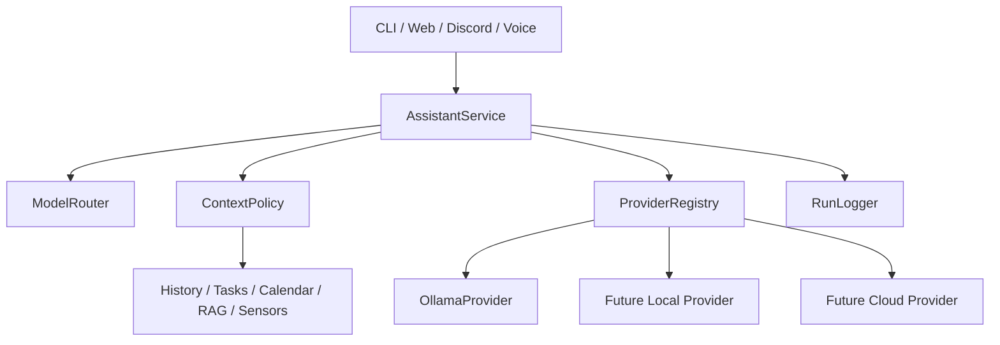

# Assistant Platform 実装計画

## 位置付け

この計画は、次の設計対話のうち「既存の`subpc_living`を壊さず、ローカルファーストなマルチモデル基盤へ育てる」部分へ集中する。

- https://chatgpt.com/share/6a818ce2-f970-83e8-b59e-25408a0a469e

3Dキャラクター、透過HUD、知覚イベントなどは`docs/companion_roadmap.md`に残すが、本計画の完了までは実装の主線に置かない。

## 実装状況

- [x] `LLMProvider`と`FakeProvider`
- [x] `GenerationOptions`とProvider共通例外
- [x] 既存`OllamaClient`へ委譲する`OllamaProvider`
- [x] `ProviderRegistry`と決定的`StaticRouter`
- [x] `AssistantService`
- [x] CLI Adapter移行
- [x] 内部バッチ処理をProvider型へ寄せる
- [x] Web移行
- [x] Voice移行 (`src/audio/pipeline.py`)
- [x] Discord移行
- [x] Voice CLIエントリポイント (`src/audio/main.py`)
- [x] 実行ログ (`src/assistant/run_logger.py`、runtime wiring済み)
- [x] `ContextBlock`契約とmetadataベース`ContextPolicy`（基盤完了）
- [x] History Context Provider / Builder移行とChatSessionへの適用（wiring完了）
- [x] Preload移行（完了・SessionPreloader由来のprofile/schedule/summaryを一括で包む）
- [x] RAG移行（完了・prompt injectionのみ）
- [x] Web search移行（完了・Context Provider化のみ、検索ロジックは未変更）
- [x] Monitor移行（完了）
- [x] Vision / Screen移行（完了・secret / local_only）
- [x] Calendar移行（完了）
- [x] Tasks移行（完了・最終権威ブロックとして末尾）
- [x] Cloud経路（Phase K、無効既定＋明示承認＋匿名化＋ローカルFallback＋OpenAI互換実送信Providerを完了。既定はローカルのみ）
- [x] Companion Phase 4〜5（知覚状態、全入口runtime wiring、決定的Proactive Policy接続）を完了。Phase 6aと6b静的3D表示は`docs/companion_roadmap.md`を正とする）

## 1. ゴール

現在の各入口が`OllamaClient`を直接呼ぶ構成から、次の依存方向へ段階移行する。



完了時に実現したいこと:

- 各UIがモデル固有APIを知らない
- モデルの選択理由とFallback経路が値として残る
- ローカル専用Contextをクラウド経路へ渡せない
- CLI、Web、Discord、音声で応答処理を重複実装しない
- Ollama停止時の失敗を共通形式で扱える
- 実モデルなしでService、Router、Privacyをテストできる

## 2. 現状と移行上の制約

### 現在の主な呼び出し経路

移行完了後、各入口は`AssistantService`へ集約された。

- `src/chat/main.py`: `AssistantService`経由でProviderを呼ぶCLI Adapter
- `src/web/server.py`: `AssistantService` + Stream Queue Adapterを利用
- `src/discord_bot/bot.py`: チャンネル別Profileを`AssistantRequest` / `GenerationOptions`へ変換して`AssistantService`へ渡す
- `src/audio/main.py`: `AssistantService.generate_stream()`を使用
- `src/audio/pipeline.py`: `AssistantService.generate_stream()`とTTSを直接接続
- `src/diary/**`, `src/persona/**`: 内部バッチ処理として`LLMProvider`を直接利用（`AssistantService`は通さない）
- `src/chat/session.py`: 履歴は`HistoryContextProvider`、Preloadは`PreloadContextProvider` / `ContextBuilder`経由で`ContextBlock`化して構築済み。PreloadはSessionPreloaderがprofile・schedule・summary・時刻を一つのstrへまとめた結果を包む移行であり、独立Profile Providerではない。RAGは`RAGContextProvider` / `ContextBuilder`経由で`ContextBlock`化して構築済み（prompt injectionのみ）。Web searchは`WebSearchContextProvider` / `ContextBuilder`経由で`ContextBlock`化して構築済み（Context Provider化のみ・検索ロジックは未変更）。Vision / Screen（secret / local_only）、Monitor / Calendar（personal / local_only）も各Context Provider経由で`ContextBlock`化して構築済み。Tasksは最終権威ブロックとしてsystem本文の末尾に置き、Historyのrole messagesは最後に`ContextBuilder`経由で描画する。Phase Jは完了し、Cloud経路（Phase K）も完了（無効が既定）

### 守る制約

1. 同期実装を維持する。最初から全面`async`化しない。
2. `ChatSession`の履歴形式とContext順序を当面維持する。
3. タスク権威ブロックはシステムプロンプト末尾という既存保証を壊さない。
4. WebSocketのイベント形式とストリーミング粒度を変えない。
5. 音声のトークン到着順、TTS開始条件、割り込み挙動を変えない。
6. Discordのチャンネル別モデル・生成設定を移行完了まで維持する。
7. クラウドProviderは`ContextPolicy`と承認経路が完成するまで追加しない。
8. 実設定、APIキー、`config/discord.env`を実装・テスト材料にしない。

## 3. 重要な設計判断

### 3.1 同期Providerを先に完成させる

現行の全経路は同期Clientまたは同期Generatorを前提としている。最初の共通契約も同期とし、FastAPI側だけスレッド・Queueへ橋渡しする。

`generate_stream_queue()`はOllama固有能力にしない。これはProviderの責務ではなく、同期GeneratorをWebSocketから読むためのAdapterとする。

```text
LLMProvider.generate_stream()
          ↓
StreamQueueAdapter
          ↓
FastAPI WebSocket
```

### 3.2 AssistantServiceは最初から履歴DBを所有しない

最初の移行では、既存Adapterが`ChatSession.build_messages()`まで担当し、Serviceへ構築済みmessagesを渡す。

```python
response = service.respond(
    request=request,
    messages=session.build_messages(),
    options=options,
)
```

これにより、履歴・RAG・タスクContextを同時に書き換えず、モデル呼び出しと経路選択だけを先に中央化できる。

Context Provider移行後は、Serviceが`ContextBuilder`を通じて必要なContextだけを構築する形へ狭める。構築済みmessagesを受ける互換経路ではクラウド利用を禁止する。

### 3.3 RouterはLLMに判断させず、最初は決定的ルールにする

初期Routerは以下だけを見る。

- 明示されたProvider / model
- `privacy`
- `profile`
- `allow_cloud`
- Providerの利用可否

難易度分類や学習Routerは、実行ログと手動Overrideが蓄積してから検討する。

### 3.4 バッチ処理と会話処理を分ける

日記、要約、プロフィール更新は`LLMProvider`を利用するが、通常の`AssistantService`へ無理に通さない。

- 会話: `AssistantService`
- 内部生成Job: `LLMProvider`を直接DI
- 承認付き長時間処理: 将来のWorkflow

これにより、会話用Personaや個人Contextが内部JSON生成へ混入するのを避ける。

## 4. 目標契約

### `AssistantRequest`

最初は必要最小限にする。

```python
@dataclass(frozen=True)
class AssistantRequest:
    text: str
    conversation_id: str
    channel: Literal["cli", "web", "discord", "voice", "internal"]
    profile: Literal[
        "chat_auto",
        "voice_fast",
        "task_local",
        "code_auto",
        "deep_reasoning",
        "private_local",
    ] = "chat_auto"
    privacy: Literal[
        "local_only",
        "local_preferred",
        "cloud_allowed",
    ] = "local_preferred"
    requested_provider: str | None = None
    requested_model: str | None = None
    allow_cloud: bool = False
```

初期段階では添付、Tools、Context本文をRequestへ直接入れない。

### `RouteDecision`

```python
@dataclass(frozen=True)
class RouteDecision:
    provider_id: str
    model: str
    local: bool
    reason: str
    fallback_provider_ids: tuple[str, ...] = ()
```

RouterはProviderオブジェクトを返さず、RegistryのIDだけを返す。

### `AssistantResponse`

```python
@dataclass(frozen=True)
class AssistantResponse:
    text: str
    route: RouteDecision
    latency_ms: int
    stats: Mapping[str, Any]
```

### ストリーム

初期版は複雑なEvent Unionを作らず、次の二段階で扱う。

1. `AssistantService.generate_stream()`は文字列tokenをyieldする
2. 完了後のRouteとstatsはServiceの結果オブジェクトまたはCallbackで取得する

WebSocketイベントを統一する必要が出た段階で、`token / completed / error`の明示Event型へ拡張する。

## 5. 実装フェーズ

各フェーズは単独でテスト・レビュー・差し戻し可能にする。1つのwriteタスクは1関心事、変更可能パスは最大5件とする。

### Phase A: Provider境界を完成させる

現在追加済み:

- `src/llm/contracts.py`
- `src/llm/provider.py`
- `src/llm/providers/fake.py`
- `tests/llm/test_provider.py`

実装済み:

1. `GenerationOptions`を追加し、生成設定の受け渡しを一箇所へ集約
2. `OllamaProvider`を追加し、既存`OllamaClient`へ委譲
3. TimeoutとHTTPエラーを共通例外へ正規化
4. `OllamaClient`自体の移動・削除は行っていない

候補ファイル:

- `src/llm/contracts.py`
- `src/llm/errors.py`
- `src/llm/providers/ollama.py`
- `tests/llm/test_ollama_provider.py`

受け入れ条件:

- Payload、`keep_alive`、`think`、生成Optionsが既存Clientと一致
- `<think>`除去と崩壊検知が変化しない
- 実OllamaなしでHTTP Mockテストが通る
- 既存`src/chat/client.py`のテストが通る

### Phase B: Registryと決定的Router

追加するもの:

- Provider IDからProviderを引く`ProviderRegistry`
- `RouteDecision`
- `ModelRouter` Protocol
- ローカル固定の`StaticRouter`

候補ファイル:

- `src/llm/registry.py`
- `src/llm/routing/contracts.py`
- `src/llm/routing/static.py`
- `tests/llm/test_registry.py`
- `tests/llm/test_static_router.py`

初期ルール:

```text
privacy == local_only         → local providerのみ
requested_provider指定       → 許可済みならそのProvider
profile == voice_fast         → local-fast
それ以外                     → local-strongまたはlegacy-default
Provider利用不可             → local fallback
```

受け入れ条件:

- 同じ入力は常に同じRouteになる
- `local_only`が非Local Providerを選べない
- 選択理由が空文字にならない
- Fallback循環を作れない

### Phase C: AssistantService本体

最初は構築済みmessagesを受け、Provider選択と生成だけを担当する。

候補ファイル:

- `src/assistant/__init__.py`
- `src/assistant/contracts.py`
- `src/assistant/service.py`
- `tests/assistant/__init__.py`
- `tests/assistant/test_service.py`

処理順:

```text
AssistantRequest
→ Router.route()
→ Registry.get()
→ Provider.generate() / generate_stream()
→ statsとlatency収集
→ AssistantResponse
```

受け入れ条件:

- `FakeProvider`だけで通常応答とStreamをテストできる
- Route理由、Provider、model、latencyがResponseに残る
- Provider失敗時に定義されたFallbackだけを試す
- すべて失敗した場合は共通例外を返す
- 構築済みmessages経路では非Local Providerを拒否する

### Phase D: CLIを最初のAdapterとして移行

対象:

- `src/chat/main.py`
- 必要なCLI回帰テスト

Adapterが残す責務:

- 入力とコマンド処理
- `ChatSession`へのuser/assistant追加
- 表示とANSI装飾
- 保存と終了処理

Serviceへ移す責務:

- Provider選択
- generate / stream実行
- Fallback
- Routeと統計の収集

受け入れ条件:

- `/help`, `/save`, `/model`, `/clear`が変わらない
- 非StreamとStreamの出力本文が同じ
- 失敗時に未完了user messageを履歴へ残さない
- `FakeProvider`をDIしたCLIテストが可能

### Phase E: 内部バッチ処理をProvider型へ寄せる

対象を小さく分けて直す。

1. Diary
2. Summarizer
3. Daily personalizer

ここでは`AssistantService`へ通さず、引数型を`OllamaClient`から`LLMProvider`へ変更する。挙動は変更しない。

受け入れ条件:

- Fakeで日記、要約、JSON抽出をテストできる
- 会話用ContextやRouterが混入しない
- 各Jobの温度、timeout、JSON処理が維持される

### Phase F: Webを移行

Webは高リスクなのでCLI後に行う。

追加候補:

- `src/assistant/stream_queue.py`
- `tests/assistant/test_stream_queue.py`

`generate_stream_queue()`相当は、任意のService streamをバックグラウンドThreadでQueueへ入れるAdapterとして実装する。

受け入れ条件:

- WebSocketのtoken順序と終了sentinelが同じ
- Queue backpressure上限を維持
- 切断時にWorkerが無制限に残らない
- HTTPの非Stream生成もService経由になる
- `/health`とモデル表示がRegistryの状態を反映する
- 既存Web UIのPayload契約を変えない

### Phase G: Discordを移行

既存`DiscordLLMProfile`を一度に削除しない。

移行順:

1. Profileを`AssistantRequest.profile`と`GenerationOptions`へ変換
2. `(base_url, model)`単位のClient cacheをRegistryへ移す
3. チャンネル→Profile対応はAdapterに残す
4. 安定後に重複設定を整理

受け入れ条件:

- チャンネル別model、system prompt、生成Optionsが同じ
- Session keyと履歴分離が変わらない
- Proactive、Training、Task UIへ影響しない
- Discord接続なしのUnit Testで経路選択を検証できる

### Phase H: Voiceを移行

`src/audio/main.py`と`src/audio/pipeline.py`は別タスクにする。

受け入れ条件:

- 最初のtoken到着でTTSを開始する既存条件を維持
- 割り込み、VAD、Wake Wordの状態遷移を変えない
- `voice_fast`がローカルProviderだけを選ぶ
- Provider失敗時のFallbackが音声Pipelineを停止させない

### Phase I: 実行ログ（完了）

Routerを高度化する前にSQLiteへ事実を記録する。実装とruntime wiringは完了済み。

実装済み:

- `src/assistant/run_logger.py`（`RunLogger` / `SQLiteRunLogger`）
- `tests/assistant/test_run_logger.py`
- Service側へ組み込み済み

最初のテーブル:

- `model_runs`: channel、profile、Provider、model、local、latency、success、error
- `route_decisions`: request ID、選択先、理由、手動Override

保存しないもの:

- 生の会話本文
- 個人Context
- APIキーなど秘密情報
- 画面、カメラ、タスク、予定の本文
- system prompt全文

受け入れ条件（達成済み）:

- ログ失敗で会話を失敗させない
- first-write-winsで同一request IDの重複を抑える
- ルーティング分析に必要な値だけで再現テストできる

### Phase J: ContextBlockとPolicy

ここで初めて`ChatSession.build_messages()`の責務を分解する。

実装状況:

- 基盤は完了: `src/context/contracts.py`（`ContextBlock` / `ContextMessage`）と`src/context/policy.py`（metadataベースの`ContextPolicy`）、`tests/context/test_policy.py`
- History移行は完了: `HistoryContextProvider`と`ContextBuilder`を実装し、`ChatSession.build_messages()`へ組み込み済み（wiring完了）
- Preload移行は完了: `PreloadContextProvider`（source=preload / sensitivity=personal / local_only=True）を実装し、`ContextBuilder.build_system_content()`と`ChatSession.build_messages()`へ組み込み済み。SessionPreloaderがprofile・schedule・summary・時刻を一つのstrへまとめた結果を包むPreloadであり、独立したProfile Providerは未実装。収集失敗時は本文をログせず型名だけwarningし、会話は継続する。`PreloadContextProvider`と`StructuredBlockNotAllowedError`は`src.context`から公開し、root公開APIテスト済み
- RAG移行は完了: `RAGContextProvider`（source=rag / sensitivity=personal / local_only=True）を実装し、`ChatSession.build_messages()`へ組み込み済み。`build_context_prompt(query)`の結果を包むだけで、retriever側のstore_turn / store_knowledge / retrieveは変更・呼び出しせず`RAGRetriever`本体も変更しない（prompt injectionのみ）。空・空白のみ・非strの結果、例外時はNoneを返し、失敗は型名だけwarningしてquery・本文・例外本文をログせず会話を継続する。`RAGContextProvider`と`RAGSource`は`src.context`から公開し、root公開APIテスト済み
- Web search移行は完了: `WebSearchContextProvider`（source=web_search / sensitivity=personal / local_only=True）を実装し、`ChatSession.build_messages()`へ組み込み済み。`build_context_prompt(query)`の結果を包むだけで、web_search側のsearch / should_search / cache / 判定ロジック自体は変更・呼び出しせず`WebSearchContext`本体も変更しない（Context Provider化のみ）。queryを含み得るためlocal_only。空・空白のみ・非strの結果、例外時はNoneを返し、失敗は型名だけwarningしてquery・本文・例外本文をログせず会話を継続する。`WebSearchContextProvider`と`WebSearchSource`は`src.context`から公開し、root公開APIテスト済み
- Monitor移行は完了: `MonitorContextProvider`（source=monitor / sensitivity=personal / local_only=True）を実装し、`ChatSession.build_messages()`へ組み込み済み。`MonitorContext`の結果を包むだけで、本体は変更しない。収集失敗は型名だけwarningして本文をログせず、会話を継続する。`MonitorContextProvider`と`MonitorSource`は`src.context`から公開し、root公開APIテスト済み
- Vision / Screen移行は完了: `VisionContextProvider`（source=vision / sensitivity=secret / local_only=True）と`ScreenContextProvider`（source=screen / sensitivity=secret / local_only=True）を実装し、`ChatSession.build_messages()`へ組み込み済み。どちらもsecret / local_onlyのため非Local経路へ渡らない。各収集失敗は型名だけwarningして本文をログせず、会話を継続する。各Providerは`src.context`から公開し、root公開APIテスト済み
- Calendar移行は完了: `CalendarContextProvider`（source=calendar / sensitivity=personal / local_only=True）を実装し、`ChatSession.build_messages()`へ組み込み済み。`CalendarContext`の結果（ファイル読取のみ）を包むだけで、本体は変更しない。収集失敗は型名だけwarningして本文をログせず、会話を継続する。`CalendarContextProvider`と`CalendarSource`は`src.context`から公開し、root公開APIテスト済み
- Tasks移行は完了: `TasksContextProvider`（source=TASKS_SOURCE / sensitivity=personal / local_only=True）を実装し、最終権威ブロックとして`ChatSession.build_messages()`のsystem本文末尾へ組み込み済み。0件でも必ず注入する。Historyのrole messagesはその後ろに`ContextBuilder`経由で描画する。収集失敗は型名だけwarningして本文をログせず、会話を継続する。`TasksContextProvider`は`src.context`から公開し、root公開APIテスト済み
- Phase J全体は完了。Cloud経路（Phase K）も完了（無効が既定；OpenAI互換実送信Providerを実装済み）
- Companion Phase 4基盤（`PerceptionEvent` / `CompanionState` / `StateAggregator` / `ActivityEventCollector`）とプラットフォーム別ActivitySource adapter（Windows / Linux(X11)、`xprintidle` / `xdotool` 必須）は完了。Web runtime wiringと読み取り専用API（`/api/companion/state`、`COMPANION_ACTIVITY_ENABLED=true` のオプトイン、起動失敗時はcompanion機能のみ無効化してWeb起動は続行）も完了。UI消費と非Web入口（Discord / Voice / Desktop）へのruntime wiringも完了（詳細は`docs/companion_roadmap.md`）

移行順:

1. History（完了）
2. Preload（完了・SessionPreloader由来のprofile/schedule/summaryを一括で包む）
3. RAG（完了・prompt injectionのみ）
4. Web search（完了・Context Provider化のみ、検索ロジックは未変更）
5. Monitor（完了）
6. Vision / Screen（完了）
7. Calendar（完了）
8. Tasks（完了）

Tasksは最終権威ブロックのため最後に移行する。

候補構造:

```text
src/context/
├── contracts.py
├── builder.py
├── policy.py
└── providers/
```

`ContextBlock`は少なくとも以下を持つ。

- `source`
- `content`
- `sensitivity`: public / personal / secret
- `local_only`
- `priority`

受け入れ条件:

- ProviderごとのContext順序がテストで固定される
- `secret`と`local_only`は非Local経路へ渡らない
- Tasks authorityが常に最後
- 収集失敗した任意Contextで会話全体を止めない
- Policyの単体テストで実際の送信Payloadを検査できる

### Phase K: Cloudと承認（完了・無効が既定）

Phase Jは完了した。Cloud経路は「無効が既定」のまま、承認・匿名化・Fallback契約とテスト双重`FakeCloudProvider`を実装した。その後、同じ境界へ`OpenAICompatibleProvider`を追加済みで、`CloudConfig(enabled=True, provider_kind="openai_compatible", ...)`を明示した場合だけ実HTTP送信を有効化できる。

必要条件:

- Cloudは初期状態で無効
- 送信Payloadを事前表示
- 1リクエスト単位の明示承認
- ローカル匿名化
- 失敗時はローカルへFallback
- Personal / Secret Contextを送れないことのテスト

上記必要条件はすべて達成済み。実装:
- `src/llm/cloud_config.py`（`CloudConfig`/`CloudConfigError`）：既定 `enabled=False`、キーは有効時かつ `api_key_env` 指定時のみ環境変数から解決（コードに埋め込まない）。`provider_kind`（`"fake"` 既定 / `"openai_compatible"`）で実送信先を選ぶ。`openai_compatible` はキー必須。
- `src/llm/providers/cloud.py`（`FakeCloudProvider`）：ネットワーク・実キーなしの非Local Provider テスト双重。
- `src/llm/providers/cloud_http.py`（`OpenAICompatibleProvider`）：OpenAI互換 `/chat/completions` の実送信 Provider。Bearer認証・SSE逐次ストリーム・usage統計・エラー正規化（Timeout→`ProviderTimeoutError`、その他→`ProviderRequestError`）。キーは環境変数からのみ取得し例外メッセージに含まない。テストは `httpx.MockTransport` 注入のみで実ネットワーク不使用。`top_k`/`repeat_penalty`/`num_ctx` は OpenAI互換APIに対応が無いため無視。
- `src/llm/approval.py`（`ApprovalGate`/`CloudPreview`/`CloudPayloadBuilder`）：1リクエスト単位の `approve`/`require`（事前表示 `preview` 付き）と、`ContextPolicy.select(target_local=False)` による public のみ選択＝ローカル匿名化。
- `src/assistant/cloud_service.py`（`CloudRouteBridge`）：`privacy=cloud_allowed` かつ `allow_cloud` のみ許可、承認必須、匿名化Payload送信、クラウド失敗時はローカル `AssistantService` へ Fallback。構築済みmessagesをそのままクラウドへ渡す経路は存在しない（既存保証維持）。
- `src/assistant/factory.py`（`build_assistant_service`）：`cloud_config` が渡されかつ 有効時のみクラウドProviderを登録（`provider_kind` で Fake/OpenAI互換 を分岐、`cloud_provider=` での直接注入も可）。`build_local_service` は従来通りローカルのみ。
- テスト: `tests/llm/test_cloud_provider.py`, `tests/llm/test_approval.py`, `tests/assistant/test_cloud_service.py`, `tests/assistant/test_factory_cloud.py`（personal/secret がクラウドPayloadへ到達しないことを検証）。

### Phase L: LangGraph

通常チャットには使わない。次のような中断・承認・再開が必要な処理だけに限定する。

- クラウド送信承認
- タスク候補の確認と登録
- コーディングJobの承認と結果確認

## 6. 基盤実装履歴

まず以下を順番に実行する。

1. **`OllamaProvider` Adapter**（完了）
   既存Clientを変更せず共通Providerへ包む。
2. **Registry + StaticRouter**（完了）
   まだ単一Local Providerでも、RouteDecisionを値として残す。
3. **AssistantService + Fakeテスト**（完了）
   構築済みmessagesを受ける安全な最小Serviceを作る。
4. **CLI移行**（完了）
   最も小さい入口でEnd-to-End経路を確認する。

この4タスクと後続のWeb・Discord・Voice・Context・Cloud移行は完了した。現在の主線は`docs/infrastructure_plan.md`を参照する。

## 7. テスト計画

### Unit

- Provider Contract
- Ollama AdapterのPayloadとエラー正規化
- Registryの重複・Close
- RouterのPrivacyルール
- ServiceのFallbackとRoute metadata
- Stream token順序

### Integration

- Fake Providerを使うCLI会話
- ChatSessionの追加・Rollback・保存
- Web Stream Queue Adapter
- Discord Profile変換
- Voice Stream接続

### Privacy

非Local ProviderのFakeへ渡されたPayloadを直接検査する。

```python
assert "calendar" not in payload
assert "screen" not in payload
assert "camera" not in payload
assert "task list" not in payload
assert api_key not in payload
```

文字列一致だけに依存せず、`ContextBlock.source`と`sensitivity`単位のPolicyテストも行う。

### 回帰

Linuxのプロジェクト環境で実行する。

```bash
.venv/bin/python -m unittest discover -s tests -q
```

現在のWindows側グローバルPythonは依存パッケージと`tzdata`が不足しているため、全体テストの基準環境にしない。

## 8. 各タスクの完了条件

- 変更対象と無関係なユーザー差分を戻していない
- `git diff --stat`で予定外ファイルがない
- 対象Unit Testが成功
- 可能ならLinux環境で全体回帰が成功
- Source変更はKimi K3の読み取り専用レビューを通す
- 実装者自身の説明だけで承認せず、独立レビューまたはテストを行う
- API、設定、既存UI契約に変更がある場合は文書を同時更新

## 9. 明示的に後回しにするもの

- 自動難易度判定Router
- LangGraph
- Redis、Queue server
- マイクロサービス化
- コーディングJob統合

PostgreSQLは`docs/infrastructure_plan.md`で段階導入を開始済み。Cloud/OpenAI互換Provider、
センサーイベント基盤、3D Shell基盤は実装済みのため、この後回し一覧から除外した。

これらは本計画の境界が安定してから上へ載せる。
