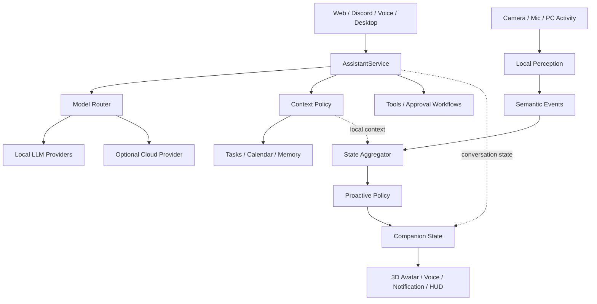

# ローカル常駐コンパニオン構想

## この文書の位置付け

ブラウザで行った3つの設計対話を、`subpc_living`で実行可能な方針へ統合したもの。
対話ログの転載ではなく、今後の設計判断と実装順序の基準とする。

## 1. プロダクトの中心

`subpc_living`を単なるローカルLLMチャットではなく、次の存在へ育てる。

> 生活環境をローカルで知覚し、言葉・表情・動作を使い分けて支援する常駐型コンパニオン

価値の中心はモデルの大きさではない。

- PC、予定、タスクなどの状況を必要最小限だけ理解する
- 必要なときだけ介入し、集中中は黙る
- 文章だけでなく表情、視線、小物、短いHUDで伝える
- 取得中の情報、保存先、利用目的を常に確認できる
- 個人情報を含む生データを原則ローカルから出さない

## 2. 設計原則

1. **ローカルファースト**
   カメラ、音声、画面、操作履歴、予定、タスク、プロフィール、長期記憶は原則ローカル固定とする。
2. **生データより意味イベント**
   画像や操作ログをLLMへ流し続けず、ローカルで`focused`、`idle`、`away`などの短いイベントへ変換する。
3. **認識・状態・判断・表現を分離**
   認識モデルに発話可否を直接決めさせない。介入頻度、禁止時間、重複抑止は決定的なPolicyで管理する。
4. **境界を先に作り、全面改修しない**
   Pythonモジュラーモノリス、SQLite、Ollama、既存のWeb・Discord・音声・Desktop・テストを維持しながら段階移行する。
5. **明示的な権限と停止手段**
   「ローカルだから何を取得してもよい」としない。センサーはオプトイン、利用中表示、即時停止、監査可能を基本にする。
6. **キャラクターは状態UI**
   アバターを装飾にせず、現在状態、通知、承認、エラーを非言語で伝えるインターフェースとする。

## 3. 目標アーキテクチャ

### 中核の責務

| 境界 | 責務 |
|---|---|
| `LLMProvider` | Ollamaなど個別の推論APIを共通契約で包む |
| `AssistantService` | 各入口から共通Requestを受け、応答処理を集約する |
| `ModelRouter` | プライバシー、用途、明示選択に基づきモデルを選ぶ |
| `ContextPolicy` | Contextの出所・機密度・送信可否を機械的に制限する |
| `EventCollector` / `Perception` | 生のセンサー入力をローカルで意味イベントへ変換する |
| `StateAggregator` | 複数イベントを安定したユーザー・相棒状態へ集約する |
| `ProactivePolicy` | 話す、表示だけする、黙る、の判断を行う |
| `Expression` | 表情、モーション、音声、HUD、通知へ変換する |

## 4. 共通データ契約の方向

将来的に次の値を明示的なオブジェクトとして扱う。

- `AssistantRequest`: 本文、会話ID、入口、用途、プライバシー、クラウド許可
- `AssistantResponse`: 本文、Provider、モデル、経路理由、レイテンシ
- `ContextBlock`: 出所、本文、機密度、許可プロファイル、優先度
- `RouteDecision`: 選択モデル、理由、信頼度、許可Context、Fallback
- `CompanionState`: 在席、活動モード、集中時間、割込可否、表示状態
- `PerceptionEvent`: 種別、時刻、要約状態、信頼度、生データ保持有無

Contextをすべて構築してから送信先を決めてはいけない。先に送信候補を決め、その送信先へ許可されたContextだけを収集する。

## 5. センサーとプライバシー

### 権限レベル

| Level | 情報 | 初期方針 |
|---:|---|---|
| 0 | 時刻、PCメトリクス、粗い在席状態 | ローカル利用可、個別停止可能 |
| 1 | 使用アプリの分類、活動時間 | オプトイン |
| 2 | ウィンドウタイトル | 個別許可 |
| 3 | 画面キャプチャ、カメラフレーム | 明示的な利用中のみ |
| 4 | OCR、画面内容、姿勢・表情推定 | 用途ごとの承認 |
| 5 | ファイル変更、外部送信 | 実行ごとの承認 |

### 守ること

- カメラ、画面認識、詳細な活動収集は初期状態で無効
- 利用中は、対象・目的・保存有無・停止操作を見える場所へ表示
- フレームは原則メモリ上で処理し、保存しない
- 顔識別ではなく在席や姿勢など粗い状態を優先
- 「今見ないで」で関連センサーを即時停止
- 生データ、個人Context、秘密情報をクラウドへ送らない
- READMEにある常時ON表現は、実装フェーズでこの方針に合わせて更新する

## 6. モデル利用方針

当面はローカルOllamaを既定とする。複数PC・複数モデル化はProviderとRouterの後に行う。

初期Routerは自動判定より手動選択を優先する。

- fast: 低レイテンシのローカルモデル
- strong: 通常・個人Contextを扱うローカルモデル
- local: 外部送信禁止
- auto: ルールベース選択
- cloud: 将来の明示承認付き経路

クラウドを導入する場合も、ローカルで匿名化した独立問題だけを送る。画面、カメラ、タスク一覧、予定、プロフィール、生の会話履歴を同伴させない。

## 7. コンパニオン体験

### 通常時

- 画面端にVRM 1.0キャラクターを透過表示
- 待機、作業中、考え中、会話中、離席、予定接近、エラーを有限状態で表現
- パネル外はクリック透過可能
- フルスクリーン、画面共有、集中モードでは縮小または非表示

### 必要なとき

- キャラクターの横へ短い半透過HUDを1枚だけ展開
- 会話、今日、タスク、PC状態、センサーを同時に常設しない
- 選択肢は2〜3個に絞り、詳細は既存Web UIへ渡す
- センサー参照時は、出所、取得時刻、保存有無を表示

### 見た目

- 全面ガラスUIにはしない
- 暗い半透明面、細い輪郭、最小限のぼかし、一本のアクセント色
- 大量の角丸カード、紫グラデーション、英語の小見出し、計器風ダッシュボードを避ける
- 学園アイドルマスター等からは「キャラクターが主役で、情報の優先順位が明快」という構造だけを参考にし、素材や画面を複製しない
- 既存Hallmarkテーマの視覚表現は継承しないが、アクセシビリティ、余白、レスポンシブ、reduced-motionの規律は残す

## 8. 実装ロードマップ

進捗は対応する節の完了条件に基づき、完了 / 一部完了 / 未着手で示す。

### Phase 1: LLM境界（完了）

- `LLMProvider`共通契約
- `FakeProvider`とContract Test
- 既存`OllamaClient`の挙動を変えず、後続Adapterの土台を作る

### Phase 2: AssistantService（完了）

- `AssistantRequest` / `AssistantResponse`
- CLIを最初のAdapterとして接続
- Web、Discord、音声を一つずつ移行

### Phase 3: ContextとRouter（一部完了）

- `ContextBlock`契約とmetadataベース`ContextPolicy`（基盤完了）
- History Context Provider / Builder移行とChatSessionへの適用（完了）
- Preload Context Provider移行（完了・SessionPreloader由来のprofile/schedule/summaryを一括で包む）
- Web search、予定、画面などのContext Providerへの段階分離（未着手・Tasksは最後）
- ローカルモデルRegistry（完了）
- 手動ルーティングと経路ログ（完了）

### Phase 4: 知覚イベントと状態（未着手）

- 使用アプリと活動時間を意味イベント化
- `focused` / `idle` / `away`の3状態
- `CompanionState`とState Aggregator
- 生データを保存していないことのテスト

### Phase 5: Proactive Policy（未着手）

- 予定接近、長時間作業、離席復帰のルール
- 黙る条件、再通知間隔、拒否フィードバック
- 提案と実行を分け、変更操作は承認必須

### Phase 6: 3DデスクトップShell（未着手）

- 仮VRMによる透明ウィンドウ
- 待機、視線、表情、リップシンク
- クイック会話HUDとセンサー確認パネル
- ユーザー所有VRMの読み込みを優先し、第三者モデルを製品へ無断同梱しない

### Phase 7: 任意の高度機能（未着手）

- 明示承認付きクラウド推論
- LangGraphによる承認・中断・再開が必要な処理だけをWorkflow化
- コーディングJob Adapter
- カメラによる在席検知は安全UI完成後に追加

## 9. 現在の実装進行単位

Phase 1〜2とRegistry/Router、CLI・Web・Discord・Voice移行、実行ログの実装とruntime wiringは完了し、Phase 3の`ContextBlock` / `ContextPolicy`基盤、History Context Provider / Builder移行、Preload Context Provider移行（SessionPreloader由来のprofile/schedule/summaryを一括で包む）、RAG Context Provider移行（prompt injectionのみ）も完了した。現在はPhase Jの次の実装単位であるWeb search Context Provider移行へ進んでいる。

### 完了: 実行ログ

- `src/assistant/run_logger.py`（`RunLogger` / `SQLiteRunLogger`）
- `tests/assistant/test_run_logger.py`
- runtime wiring済み（Service側へ組み込み済み）
- SQLiteへ保存するのはchannel、profile、provider、model、local、latency、success、error等の経路決定と実行結果のみ
- 会話本文、個人Context、APIキーなどの秘密情報、画面・カメラ・タスク・予定の本文は保存しない

受け入れ条件（達成済み）:

- ログ失敗で会話を失敗させない
- first-write-winsで同一request IDの重複を抑える
- 経路と統計だけで再現テストできる

### 完了: ContextBlock / ContextPolicy基盤

- `ContextBlock`契約とmetadataベースの`ContextPolicy`（sensitivity / local_only / 送信先 / priority）を実装し、テスト済み
- Tasksは最終権威ブロックとして最後に移行する方針を維持

### 完了: History Context Provider / Builder移行

- `HistoryContextProvider`が現在の履歴を不変な`ContextMessage`列へコピーし、`ContextBlock`（source=history / sensitivity=personal / local_only=True）として返す
- `ContextBuilder`がPolicy通過済みブロックを既存互換のrole/content dict列へ描画し、`ChatSession.build_messages()`へ組み込み済み
- 次はPreloadをContext Provider化し、続いてRAG、Web search、予定、画面などを順次分離する（Tasksは最後）

### 完了: Preload Context Provider移行（profile/schedule/summaryを一括で包む）

- `PreloadContextProvider`が`build_preload_context()`の結果をsource=preload / sensitivity=personal / local_only=Trueのstr ContextBlockとして返す
- この結果はSessionPreloaderがprofile・schedule・summary・時刻を一つのstrへまとめたPreloadであり、独立したProfile Providerの成果ではない
- 収集失敗は本文をログせず型名だけwarningし、会話を止めず継続する
- `ContextBuilder.build_system_content()`がstr blockだけをbase systemへ連結し、構造化blockは`StructuredBlockNotAllowedError`で明示拒否する
- `ChatSession.build_messages()`はPreloadを`ContextPolicy`経由（local_only / local target）で描画し、既存のsystem_prompt直後・RAG前の位置を維持
- `PreloadContextProvider`と`StructuredBlockNotAllowedError`は`src.context`から公開し、root公開APIテスト済み
- 次はWeb search Context Provider移行（Tasksは最後）

### 完了: RAG Context Provider移行（prompt injectionのみ）

- `RAGContextProvider.collect(retriever, query)`が`build_context_prompt(query)`の結果をsource=rag / sensitivity=personal / local_only=Trueのstr ContextBlockとして返す
- `RAGSource` Protocolで型契約だけを定義し、`RAGRetriever`本体は変更しない。store_turn / store_knowledge / retrieveの実装自体は変更・呼び出しせず、RAGはプロンプトへの注入のみを行う
- 空・空白のみ・非strの結果、およびretrieverの例外時はNoneを返す。例外は型名だけlogging.warningに残し、query・本文・例外本文はログしない。収集失敗で会話は止まらず継続する
- `ChatSession.build_messages()`はRAGを`ContextBuilder` / `ContextPolicy`経由（local_only / local target）で描画し、Preload直後・Web search前の既存位置を維持する
- `store_turn`による会話記録は従来どおり呼び出される
- `RAGContextProvider`と`RAGSource`は`src.context`から公開し、root公開APIテスト済み
- 次はWeb search Context Provider移行（Tasksは最後）

## 10. 現時点の非目標

- 全面LangChain / LangGraph化
- マイクロサービス、Redis、Kafka、Kubernetesの導入
- SQLiteや既存データストアの一括移行
- いきなり全入口を`AssistantService`へ切り替えること
- 感情認識やカメラ常時利用を先行させること
- 高品質な専用3Dモデル制作をソフトウェア境界より先に行うこと
- 第三者のVRChatモデルを製品へ再配布すること

## 11. 未決事項

- `AssistantRequest`の最終フィールドと同期・非同期境界
- 複数ローカルモデルの命名・Registry形式
- デスクトップShellを既存QML、Tauri、Electronのどれで進めるか
- VRM RendererとPythonバックエンド間のIPC方式
- イベント保存期間と監査ログの粒度
- 製品用オリジナルキャラクターと衣装規格

## 12. 元になった設計対話

- [アーキテクチャ、モデルルーティング、段階改修](https://chatgpt.com/share/6a818ce2-f970-83e8-b59e-25408a0a469e)
- [UI、相棒中心の体験、ローカル知覚](https://chatgpt.com/share/6a8185b1-dc3c-83ee-be4c-7175c0eaa612)
- [製品化、3Dキャラクター、透過HUD](https://chatgpt.com/share/6a818d11-f610-83e8-ad95-5e202ba3f5a5)
