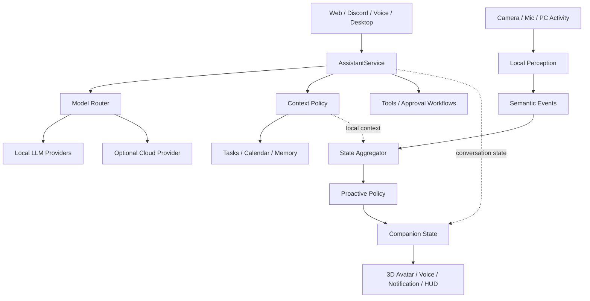

# ローカル常駐コンパニオン構想

## この文書の位置付け

ブラウザで行った3つの設計対話を、`subpc_living`で実行可能な方針へ統合したもの。
対話ログの転載ではなく、今後の設計判断と実装順序の基準とする。

## 1. プロダクトの中心

`subpc_living`を単なるローカルLLMチャットではなく、次の存在へ育てる。

> 生活環境をローカルで知覚し、言葉・表情・動作を使い分けて支援する常駐型コンパニオン

価値の中心はモデルの大きさではない。

- PC、予定、タスクなどの状況を必要最小限だけ理解する
- 必要なときだけ介入し、集中中は黙る
- 文章だけでなく表情、視線、小物、短いHUDで伝える
- 取得中の情報、保存先、利用目的を常に確認できる
- 個人情報を含む生データを原則ローカルから出さない

## 2. 設計原則

1. **ローカルファースト**
   カメラ、音声、画面、操作履歴、予定、タスク、プロフィール、長期記憶は原則ローカル固定とする。
2. **生データより意味イベント**
   画像や操作ログをLLMへ流し続けず、ローカルで`focused`、`idle`、`away`などの短いイベントへ変換する。
3. **認識・状態・判断・表現を分離**
   認識モデルに発話可否を直接決めさせない。介入頻度、禁止時間、重複抑止は決定的なPolicyで管理する。
4. **境界を先に作り、全面改修しない**
   Pythonモジュラーモノリス、SQLite、Ollama、既存のWeb・Discord・音声・Desktop・テストを維持しながら段階移行する。
5. **明示的な権限と停止手段**
   「ローカルだから何を取得してもよい」としない。センサーはオプトイン、利用中表示、即時停止、監査可能を基本にする。
6. **キャラクターは状態UI**
   アバターを装飾にせず、現在状態、通知、承認、エラーを非言語で伝えるインターフェースとする。

## 3. 目標アーキテクチャ

### 中核の責務

| 境界 | 責務 |
|---|---|
| `LLMProvider` | Ollamaなど個別の推論APIを共通契約で包む |
| `AssistantService` | 各入口から共通Requestを受け、応答処理を集約する |
| `ModelRouter` | プライバシー、用途、明示選択に基づきモデルを選ぶ |
| `ContextPolicy` | Contextの出所・機密度・送信可否を機械的に制限する |
| `EventCollector` / `Perception` | 生のセンサー入力をローカルで意味イベントへ変換する |
| `StateAggregator` | 複数イベントを安定したユーザー・相棒状態へ集約する |
| `ProactivePolicy` | 話す、表示だけする、黙る、の判断を行う |
| `Expression` | 表情、モーション、音声、HUD、通知へ変換する |

## 4. 共通データ契約の方向

将来的に次の値を明示的なオブジェクトとして扱う。

- `AssistantRequest`: 本文、会話ID、入口、用途、プライバシー、クラウド許可
- `AssistantResponse`: 本文、Provider、モデル、経路理由、レイテンシ
- `ContextBlock`: 出所、本文、機密度、許可プロファイル、優先度
- `RouteDecision`: 選択モデル、理由、信頼度、許可Context、Fallback
- `CompanionState`: 在席、活動モード、集中時間、割込可否、表示状態
- `PerceptionEvent`: 種別、時刻、要約状態、信頼度、生データ保持有無

Contextをすべて構築してから送信先を決めてはいけない。先に送信候補を決め、その送信先へ許可されたContextだけを収集する。

## 5. センサーとプライバシー

### 権限レベル

| Level | 情報 | 初期方針 |
|---:|---|---|
| 0 | 時刻、PCメトリクス、粗い在席状態 | ローカル利用可、個別停止可能 |
| 1 | 使用アプリの分類、活動時間 | オプトイン |
| 2 | ウィンドウタイトル | 個別許可 |
| 3 | 画面キャプチャ、カメラフレーム | 明示的な利用中のみ |
| 4 | OCR、画面内容、姿勢・表情推定 | 用途ごとの承認 |
| 5 | ファイル変更、外部送信 | 実行ごとの承認 |

### 守ること

- カメラ、画面認識、詳細な活動収集は初期状態で無効
- 利用中は、対象・目的・保存有無・停止操作を見える場所へ表示
- フレームは原則メモリ上で処理し、保存しない
- 顔識別ではなく在席や姿勢など粗い状態を優先
- 「今見ないで」で関連センサーを即時停止
- 生データ、個人Context、秘密情報をクラウドへ送らない
- READMEにある常時ON表現は、実装フェーズでこの方針に合わせて更新する

## 6. モデル利用方針

当面はローカルOllamaを既定とする。複数PC・複数モデル化はProviderとRouterの後に行う。

初期Routerは自動判定より手動選択を優先する。

- fast: 低レイテンシのローカルモデル
- strong: 通常・個人Contextを扱うローカルモデル
- local: 外部送信禁止
- auto: ルールベース選択
- cloud: 将来の明示承認付き経路

クラウドを導入する場合も、ローカルで匿名化した独立問題だけを送る。画面、カメラ、タスク一覧、予定、プロフィール、生の会話履歴を同伴させない。

## 7. コンパニオン体験

### 通常時

- 画面端にVRM 1.0キャラクターを透過表示
- 待機、作業中、考え中、会話中、離席、予定接近、エラーを有限状態で表現
- パネル外はクリック透過可能
- フルスクリーン、画面共有、集中モードでは縮小または非表示

### 必要なとき

- キャラクターの横へ短い半透過HUDを1枚だけ展開
- 会話、今日、タスク、PC状態、センサーを同時に常設しない
- 選択肢は2〜3個に絞り、詳細は既存Web UIへ渡す
- センサー参照時は、出所、取得時刻、保存有無を表示

### 見た目

- 全面ガラスUIにはしない
- 暗い半透明面、細い輪郭、最小限のぼかし、一本のアクセント色
- 大量の角丸カード、紫グラデーション、英語の小見出し、計器風ダッシュボードを避ける
- 学園アイドルマスター等からは「キャラクターが主役で、情報の優先順位が明快」という構造だけを参考にし、素材や画面を複製しない
- 既存Hallmarkテーマの視覚表現は継承しないが、アクセシビリティ、余白、レスポンシブ、reduced-motionの規律は残す

## 8. 実装ロードマップ

### Phase 1: LLM境界

- `LLMProvider`共通契約
- `FakeProvider`とContract Test
- 既存`OllamaClient`の挙動を変えず、後続Adapterの土台を作る

### Phase 2: AssistantService

- `AssistantRequest` / `AssistantResponse`
- CLIを最初のAdapterとして接続
- Web、Discord、音声を一つずつ移行

### Phase 3: ContextとRouter

- `ContextBlock`と`ContextPolicy`
- ローカルモデルRegistry
- 手動ルーティングと経路ログ
- タスク、予定、画面などをContext Providerへ段階分離

### Phase 4: 知覚イベントと状態

- 使用アプリと活動時間を意味イベント化
- `focused` / `idle` / `away`の3状態
- `CompanionState`とState Aggregator
- 生データを保存していないことのテスト

### Phase 5: Proactive Policy

- 予定接近、長時間作業、離席復帰のルール
- 黙る条件、再通知間隔、拒否フィードバック
- 提案と実行を分け、変更操作は承認必須

### Phase 6: 3DデスクトップShell

- 仮VRMによる透明ウィンドウ
- 待機、視線、表情、リップシンク
- クイック会話HUDとセンサー確認パネル
- ユーザー所有VRMの読み込みを優先し、第三者モデルを製品へ無断同梱しない

### Phase 7: 任意の高度機能

- 明示承認付きクラウド推論
- LangGraphによる承認・中断・再開が必要な処理だけをWorkflow化
- コーディングJob Adapter
- カメラによる在席検知は安全UI完成後に追加

## 9. 今回の最初の実装単位

今回着手するのはPhase 1のうち、既存挙動へ影響しない部分だけとする。

- `src/llm/contracts.py`
- `src/llm/provider.py`
- `src/llm/providers/fake.py`
- Provider Contract Test

受け入れ条件:

- 既存のWeb、Discord、音声、CLIの呼び出し経路を変更しない
- Ollamaや実GPUを必要とせずFakeだけでテストできる
- 非ストリーム、ストリーム、統計、終了処理を共通契約で表現できる
- 既存テストが回帰しない

## 10. 現時点の非目標

- 全面LangChain / LangGraph化
- マイクロサービス、Redis、Kafka、Kubernetesの導入
- SQLiteや既存データストアの一括移行
- いきなり全入口を`AssistantService`へ切り替えること
- 感情認識やカメラ常時利用を先行させること
- 高品質な専用3Dモデル制作をソフトウェア境界より先に行うこと
- 第三者のVRChatモデルを製品へ再配布すること

## 11. 未決事項

- `AssistantRequest`の最終フィールドと同期・非同期境界
- 複数ローカルモデルの命名・Registry形式
- デスクトップShellを既存QML、Tauri、Electronのどれで進めるか
- VRM RendererとPythonバックエンド間のIPC方式
- イベント保存期間と監査ログの粒度
- 製品用オリジナルキャラクターと衣装規格

## 12. 元になった設計対話

- [アーキテクチャ、モデルルーティング、段階改修](https://chatgpt.com/share/6a818ce2-f970-83e8-b59e-25408a0a469e)
- [UI、相棒中心の体験、ローカル知覚](https://chatgpt.com/share/6a8185b1-dc3c-83ee-be4c-7175c0eaa612)
- [製品化、3Dキャラクター、透過HUD](https://chatgpt.com/share/6a818d11-f610-83e8-ad95-5e202ba3f5a5)
